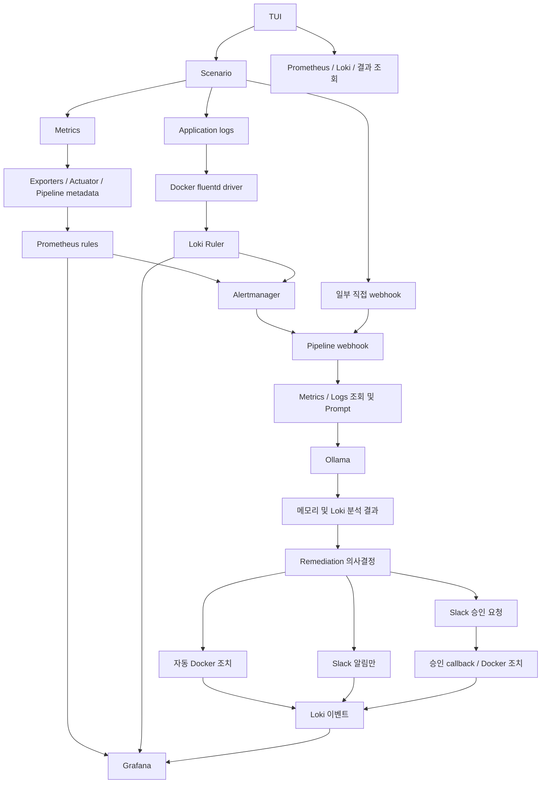

# System Architecture

검증 기준일: 2026-09-19. 상태: 구현 전 설계 기준선.

[README](./README.md)의 근거 우선순위를 따른다. 이 문서의 As-Is는 source/configuration 정적 분석 결과다. To-Be는 [DESIGN](./DESIGN.md)의 목표이며 아직 구현되지 않았다. legacy는 현재 구조의 근거로 사용하지 않았다.

## 1. As-Is: 구성과 배포

### 1.1 컴포넌트

| 계층 | 실제 구성 | 근거 |
|---|---|---|
| 서비스 | frontend: Nginx 정적 서비스·프록시, backend: Spring datasource/Actuator 환경설정, db: PostgreSQL 16 | [Compose](../docker-compose.yml), [Nginx](../leafy/nginx/default.conf) |
| 수집 | node-exporter, cadvisor, nginx-exporter, postgres-exporter, fluentd | Compose services, [Prometheus scrape](../monitoring/prometheus/prometheus.yml) |
| 저장·탐지 | Prometheus rules, Loki Ruler, Alertmanager | monitoring/prometheus, monitoring/loki, monitoring/alertmanager |
| 분석 | pipeline: FastAPI, collector, prompt, schema; ollama: 추론 | [Pipeline](../aiops/pipeline/main.py), [config](../aiops/pipeline/config.py) |
| 대응 | remediation: FastAPI, docker-py, Slack | [Remediation](../aiops/remediation/main.py), actions/container.py, actions/notify.py |
| 관측·데모 | Grafana, Rich 기반 시나리오 CLI와 verifier | monitoring/grafana, scenarios/run.py, scenarios/common |

서비스 애플리케이션은 외부 이미지 gicks/leafy-frontend, gicks/leafy-backend로 실행하도록 설정돼 있다. 해당 이미지 내부 구현 전체를 이 repository만으로 검증한 것은 아니다.

Compose 서비스명은 pipeline이고 container_name은 aiops-pipeline이다. 두 이름을 명령 인자에서 혼용하지 않는다. 모든 Compose 서비스에는 이미 container_name이 있다.

### 1.2 네트워크와 포트

- frontend/db는 leafy-net, backend는 leafy-net과 mgmt-net 양쪽에 연결된다.
- nginx-exporter/postgres-exporter/fluentd는 양쪽에 연결된다.
- node-exporter/cadvisor는 mgmt-net만 사용하며 호스트 경로 mount로 수집한다.
- Prometheus/Loki/Alertmanager/Grafana/Pipeline/Ollama/Remediation은 mgmt-net을 사용한다.
- 호스트 publish: frontend 80/443, Fluentd 24224, Prometheus 9090, Alertmanager 9093, Loki 3100, Grafana 3000, Ollama 11434, Pipeline 8000, Remediation 8001.
- backend 8080과 db 5432는 Compose에서 호스트 publish하지 않는다.

따라서 관리망을 완전히 외부 접근에서 격리했다고 주장하지 않는다. Pipeline과 Remediation에는 Docker socket도 mount된다.

### 1.3 설정과 실행 전제

- Prometheus scrape/evaluation: 각 5초. 보존 기간: Compose의 30d.
- Alertmanager: group_wait=10s, group_interval=10s, repeat_interval=240s, send_resolved=true.
- Pipeline: resolved skip, dedup 300초, LLM semaphore 1, LLM 호출 최대 두 번.
- Compose의 LLM_MODEL은 llama3.2:3b, config.py 기본값은 llama3.1:8b다. Compose 배포에는 전자가 적용된다.
- Ollama: gpus=all, OLLAMA_NUM_PARALLEL=1, OLLAMA_MAX_QUEUE=1. 실제 GPU 및 모델 준비 여부는 미검증이다.
- Loki 로그 보존 정책은 명시되어 있지 않다. 오래된 샘플 입력 거부 설정은 보존 기간과 다르다.
- 인증서 bind mount, Slack webhook 및 애플리케이션 환경변수는 실행 환경 확인 대상이다. 설정 기본값의 존재는 정상 실행 증거가 아니다.

## 2. As-Is: 실제 데이터 흐름

그림은 주요 연결을 나타낸다. fallback·unknown·실패 시 조치로 진행하지 않는 분기도 있다. Grafana와 TUI는 Remediation 이후에만 실행되는 마지막 단계가 아니다.

### 2.1 Metrics와 Logs

[Prometheus 설정](../monitoring/prometheus/prometheus.yml)은 exporter, backend /actuator/prometheus, pipeline /metrics를 scrape한다. Pipeline /metrics의 container_name_info를 CPU·메모리 rule이 join한다. 기존 endpoint를 대체하면 탐지 자체가 깨질 수 있다.

[Prometheus alert rules](../monitoring/prometheus/rules/alert.rules.yml)는 6개, [Loki rules](../monitoring/loki/rules/fake/security-rules.yml)는 9개다. HighNginxRequestRate는 요청량, HighNginxErrorRate는 Loki 앱 로그 기반 5xx 개수 탐지다. Nginx stub_status가 상태코드별 메트릭을 제공한다고 가정하지 않는다.

Fluentd driver는 frontend/backend/db에 설정되어 있다. 모든 컨테이너 stdout을 수집하는 구성은 아니다. [fluent.conf](../leafy/fluentd/fluent.conf)는 Docker tag를 container 라벨로 변환하고 key_value 형식으로 Loki에 전송한다.

| Docker 이름 | Fluentd/Loki 앱 로그 태그 |
|---|---|
| leafy-backend | backend |
| leafy-frontend | frontend |
| leafy-db | leafy-db |

[LogsCollector.fetch_around()](../aiops/pipeline/collector/logs.py)는 현재 Docker 이름을 그대로 selector에 넣어 backend/frontend 앱 로그를 놓친다. [MetricsCollector.fetch_around()](../aiops/pipeline/collector/metrics.py)는 Docker socket으로 ID를 찾아 CPU·메모리·네트워크·호스트 지표를 조회한다. Nginx 요청량은 이 collector의 수집 항목에 없다.

수집 범위는 alert.startsAt ±5분이다. 호출 시점에 아직 존재하지 않는 미래 샘플을 기다리지 않는다. 오래된 startsAt의 결과를 현재 상태 전체로 해석해서는 안 된다.

### 2.2 Pipeline

실제 함수 순서: receive_alert() → analyze_alerts() → collector → PromptBuilder.build() → call_llm() → push_to_loki() → forward_to_remediation().

- annotation.container 우선, labels.container fallback은 이미 구현됐다.
- HighCpuUsage만 unknown일 때 CPU auto-resolve한다. 해당 쿼리는 container_name_info join이 없다.
- unknown 정확 일치만 검사하므로 unknown (host-level)을 제대로 차단하지 못한다.
- AlertLabel은 name/id 등 원본 라벨 전체를 보존하지 않는다.
- 결과는 analysis_history deque(maxlen=20)와 Loki에 기록한다.
- results/llm_results.jsonl 파일과 mount는 있지만 현재 main.py에 JSONL writer는 없다.
- /health, /metrics, /webhook/alert는 존재하지만 /results와 /results/latest route는 없다.
- confidence=0 및 action_type=NONE fallback은 Remediation 전달을 생략한다.
- 일부 outbound HTTP 호출은 상태 코드를 확인하지 않는다. 요청 완료를 처리 성공으로 단정할 수 없다.

### 2.3 Remediation / Slack

execute_action()의 현재 분기:

| 조건 | 실제 동작 |
|---|---|
| risk=low, confidence>=0.7, 지원 조치, target 있음 | RESTART/ISOLATE/PAUSE/THROTTLE 자동 실행, Slack 없음 |
| low 고신뢰이나 target 없음 | 승인 요청 |
| low 고신뢰, 자동 실행 목록 외 조치 | 알림만 |
| low 저신뢰 | 승인 요청 |
| medium 및 threat=low | 알림만 |
| 나머지 medium/high | 승인 요청 |

/slack/action의 승인 실행 목록은 현재 RESTART/ISOLATE뿐이다. PAUSE/THROTTLE은 자동 handler가 있지만 승인 후 실행되지 않는다. schema는 SCALE도 허용하지만 실행 handler가 없다.

ContainerActions.isolate()는 graduation-project_leafy-net을 고정 조회한다. 네트워크가 없으면 조치를 생략해도 _execute()가 Success를 반환할 수 있다. 조치 성공은 서비스 복구나 전체 네트워크 격리 완료를 뜻하지 않는다.

Notifier._send_slack()는 HTTP 200과 본문 ok를 성공으로 본다. 같은 notification을 notify.py와 remediation/main.py가 중복 Loki 기록한다. 자동 조치에는 notification이 없으며 periodic Slack은 별도 직접 전송 경로다. Slack 요청 서명 검증과 재실행 방지는 현재 callback에 없다.

### 2.4 현재 Loki 이벤트

| job | 생성 코드 | 제한 |
|---|---|---|
| aiops-llm | Pipeline.push_to_loki | 분석 결과와 fallback 포함 |
| aiops-llm-error | Pipeline.call_llm | 실패한 LLM 원문 기록 |
| aiops-timeline | Pipeline, Remediation, 일부 scenario | 모든 탐지 단계의 완전한 기록은 아님 |
| aiops-remediation | Remediation._push_remediation_status | 현재 주로 자동 조치 결과 |
| aiops-slack | Notifier와 Remediation | 중복 기록, 발생 건 식별자 없음 |

## 3. As-Is: TUI와 Grafana

### 3.1 실제 진입점과 한계

| 진입점/관련 파일 | 동작과 검증된 한계 |
|---|---|
| [scenarios/run.py](../scenarios/run.py): main / run_scenario | 통합 선택·subprocess·live 로그. 없는 /results 호출, 결과 개수 증가로 신규 여부 추정 |
| [verifier.py](../scenarios/common/verifier.py): ScenarioVerifier | Rich Live와 메트릭 그래프. Prometheus FIRING 및 Slack 이벤트 측정 |
| [result_viewer.py](../scenarios/common/result_viewer.py): ResultViewer | Loki 직접 조회. 최근 1시간 같은 alert의 과거 결과가 섞일 수 있음 |
| [cli_demo.py](../scenarios/cli_demo.py): run | 없는 /results/latest 호출, 일부 없는 시나리오 모듈 참조, 연출상 성공 문구 |
| [scenario_pgminer.py](../scenarios/category3/scenario_pgminer.py): main | 통합 SOC 데모 및 Grafana UID leafy-aiops 연결 |
| [batch_runner.py](../scenarios/eval/batch_runner.py): poll_llm_result | 없는 /results 응답을 dict envelope로 기대 |

run.py::panel_remediation은 risk만 보고 실행 성공을 추정한다. 이것을 실제 조치 증거로 사용하지 않는다. verifier의 verify_loki는 로그 키워드 발견이며 Ruler 발화 검증이 아니다. 일부 시나리오는 직접 webhook으로 detector/Alertmanager를 우회한다.

### 3.2 Grafana provisioning은 존재함

- [dashboards.yml](../monitoring/grafana/provisioning/dashboards/dashboards.yml): provider path=/etc/grafana/provisioning/dashboards.
- Compose: ./monitoring/grafana/provisioning:/etc/grafana/provisioning.
- [datasources.yml](../monitoring/grafana/provisioning/datasources/datasources.yml): Prometheus UID PBFA97CFB590B2093, Loki UID P8E80F9AEF21F6940.
- [aiops_dashboard.json](../monitoring/grafana/provisioning/dashboards/aiops_dashboard.json): UID aiops-main, 제목 AIOps 모니터링 대시보드.
- [leafy_aiops_soc_dashboard.json](../monitoring/grafana/provisioning/dashboards/leafy_aiops_soc_dashboard.json): UID leafy-aiops, 제목 Leafy AIOps SOC Dashboard.

필요한 것은 기존 query/threshold/aggregation/datasource/alert representation 검증이다. DB 패널은 합계와 50 임계값을 표시하지만 rule은 개별 pg_stat_activity_count >40이다. Prometheus ALERTS는 Loki alert 전체를 표시하는 근거가 아니다. LLM count 패널의 target은 Loki datasource를 지정하므로 상위 panel datasource만 보고 쿼리 오류를 단정하지 않는다.

## 4. As-Is: Loki rules/fake 유지 근거

[Compose](../docker-compose.yml): ./monitoring/loki/rules:/loki/rules 및 loki_data:/loki.
[설정](../monitoring/loki/loki-config.yml): auth_enabled=false, ruler.storage.type=local, directory=/loki/rules, rule_path=/tmp/loki-ruler, alertmanager_url=http://alertmanager:9093.

따라서 파일 경로는 /loki/rules/fake/security-rules.yml이다. fake는 단일 tenant ID이며 그 아래 파일이 rule namespace를 나타낸다. 임의 경로의 YAML을 재귀 로딩하므로 괜찮다는 설명은 사용하지 않는다. 디렉터리 이동·rename은 비목표다. rule 내용 수정과 디렉터리 구조 변경은 구분한다.

보조 근거: [Loki alerting/ruler storage](https://grafana.com/docs/loki/latest/alert/), [Loki configuration](https://grafana.com/docs/loki/latest/configure/). 실제 설치 이미지 버전의 로딩 상태는 향후 runtime 검증 대상이다.

## 5. To-Be: 최소 변경 구조

| 목표 | 설계 / 작업 |
|---|---|
| Docker 대상과 Loki 앱 태그 분리, host 오귀속 방지 | D1 / TASK-001 |
| Loki 기준 결과 + 단일 GET /results + 실행별 연결 | D2 / TASK-002 |
| LLM 권고와 실제 조치 상태 분리 | D3 / TASK-003 |
| MTTD와 Slack notification latency의 정확한 정의 | D4 / TASK-004 |
| 로그 생성·detector 발화·AM 전달·분석 단계별 검증 | D5 / TASK-005 |
| HTTP 실패·관측 불능을 성공과 구분 | D6 / TASK-006 |
| 기존 dashboard 보정, UID와 provider 유지 | D7 / TASK-007 |
| ENABLE_PERIODIC_SCAN=false와 기존 coroutine lifecycle | D8 / TASK-008 |
| 통합 경로 검증과 최종 문서 정합성 | TASK-009 |

To-Be에서도 탐지와 직접 webhook, 자동 조치와 Slack 분기는 유지한다. Loki가 분석·조치·알림 이벤트의 기준 저장소이며 메모리는 진단용이다. GET /results는 신규 구현 예정인 조회 adapter로, 기존 query 소비 코드를 하나의 계약으로 이동한다. 분산 event bus, 신규 DB, 전면 이름 변경, 새로운 dashboard 제품을 만들지 않는다.

## 6. Runtime 확인이 필요한 가정

- cAdvisor id/CPU 라벨과 container_name_info join, exporter/Actuator 응답.
- Fluentd tag와 실제 앱 로그 전달, Loki rule 로딩·평가·Alertmanager 전달.
- Grafana provider 로딩, JSON target datasource, 정상 no-data와 오류 구분.
- Loki/Prometheus Alert API에서의 원본 labels/startsAt 대응과 polling 오차. startsAt을 실제 FIRING 전이 시각으로 단정하지 않는다.
- GPU/모델·인증서·환경변수, Slack 외부 callback 도달 경로와 요청 검증.
- Loki 기록 실패 시 결과 조회 불능, 실제 Docker 실행 여부 불명 상태.

현재 문서 작성 과정에서는 위 runtime test를 수행하지 않았다. 구체적 절차와 실패 기준은 TASKS에 정의한다.
